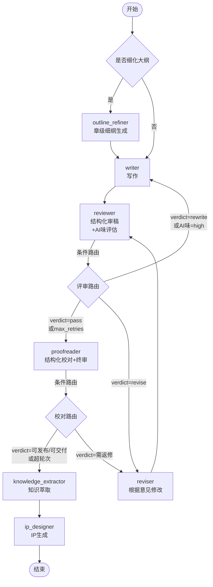

# Pipeline 流程详解

## 图结构

StoryForge 使用 LangGraph 构建 Pipeline，以 `NovelState` 为共享状态，节点之间通过条件边和循环边实现复杂的审稿-修改闭环。



## 配置选项

```python
from pipeline.novel_pipeline import NovelPipeline

pipeline = NovelPipeline(
    llm_client=llm_client,
    use_memory=True,                      # 是否启用记忆系统
    use_outline_refinement=True,         # 是否启用大纲细化
    use_extraction=True,                 # 是否启用知识萃取
    use_ip_generation=True,              # 是否启用IP生成
    checkpoint_dir=".checkpoints",       # 断点续跑目录
    ip_output_dir="./ip_assets"          # IP资产输出目录
)
```

## 节点列表

| 节点 | 模块 | 职责 | 输出到 state |
|------|------|------|--------------|
| `outline_refiner` | `stages/outline/OutlineGenerator` | 从卷纲生成章级细纲 | `creation.chapter_outlines` |
| `writer` | `agents/creation_agents.WriterAgent` | 基于细纲创作章节 | `chapters[current_chapter]`, `chapter_status` |
| `reviewer` | `agents/creation_agents.ReviewerAgent` | 结构化审稿 + AI味评估 | `structured_reviews`, `reviews`, `review_round` |
| `reviser` | `agents/creation_agents.ReviserAgent` | 根据审稿意见修改 | `chapters[current_chapter]`, `chapter_status` |
| `proofreader` | `agents/creation_agents.ProofreaderAgent` | 结构化校对 + 终审判定 | `proofread_results`, `proofread_records` |
| `knowledge_extractor` | `stages/extraction/KnowledgeExtractor` | 从章节提取知识 | `chapter_analyses`, `current_stage=extraction` |
| `ip_designer` | `stages/ip_generation/IPGenerator` | 生成 IP 资产 | `story_bible`, `character_ips`, `current_stage=ip_generation` |

## 视频生成节点（可选）

在启用了视频生成功能时，Pipeline 会在 IP 生成阶段或作为单独流程插入视频节点，主要节点如下：

| 节点 | 模块 | 职责 | 输出到 state |
|------|------|------|--------------|
| `video_script` | `stages/video_script/VideoScriptGenerator` | 从章节生成镜头级剧本（ShotSpec 列表） | `creation.video_script_id` |
| `visual_bible` | `stages/video_bible/VisualBibleBuilder` | 构建人物视觉圣经与场景参考 | `creation.visual_bible_id` |
| `video_assets` | `stages/video_assets/VideoAssetGenerator` | 为角色/场景生成参考图与镜头参考资产 | `creation.video_manifest_id` |
| `video_consistency` | `core.video.consistency.VideoConsistencyService` | 对镜头、角色视觉与文本做量化一致性检查并记录回退原因 | `creation.video_consistency_report_id`, `video_fallback_reasons` |
| `video_generate` | `stages/video_generation/VideoGenerator` | 调用 VideoProvider 生成镜头片段并汇总为渲染计划与输出 | `creation.video_output_id`, `video_render_plan_id` |

路由逻辑：`video_consistency` 节点可触发自动回退（例如重新生成资产或降低阈值），并将回退原因写入 `NovelState.video_fallback_reasons`。

## 路由逻辑

### 审稿路由（`_review_router`）

```python
# 优先级：
# 1. 错误状态 → max_retries
# 2. 超轮次 → max_retries
# 3. AI味=high → rewrite
# 4. verdict=pass → approve
# 5. verdict=rewrite → rewrite
# 6. verdict=revise → revise
# 7. 回退：分数判断 (≥85/60-84/<60)
```

| 条件 | 路由 | 说明 |
|------|------|------|
| `state.error_message` 存在 | `max_retries` → proofreader | 错误状态强制放行 |
| `review_round >= max_review_rounds` | `max_retries` → proofreader | 超轮次强制放行，避免死循环 |
| `ai_flavor_level == "high"` | `rewrite` → writer | AI味过重，要求重写 |
| `verdict == "pass"` | `approve` → proofreader | 高分通过 |
| `verdict == "revise"` | `revise` → reviser | 需修改 |
| `verdict == "rewrite"` | `rewrite` → writer | 要求重写 |
| `score >= 85` | `approve` → proofreader | （回退）高分通过 |
| `60 <= score < 85` | `revise` → reviser | （回退）需修改 |
| `score < 60` | `rewrite` → writer | （回退）要求重写 |

### 校对路由（`_proofread_router`）

```python
# 优先级：
# 1. verdict="可发布"/"可交付" → pass
# 2. verdict="需返修" → fail
# 3. status=APPROVED → pass
# 4. 超轮次 → pass
# 5. 其他 → fail
```

| 条件 | 路由 | 说明 |
|------|------|------|
| `verdict in ("可发布", "可交付")` | `pass` → knowledge_extractor | 终审通过 |
| `verdict == "需返修"` | `fail` → reviser | 返回修改 |
| `status == APPROVED` | `pass` → knowledge_extractor | （回退）状态为通过 |
| `review_round >= max_review_rounds + 2` | `pass` → knowledge_extractor | 校对也超次，强制放行 |
| 其他 | `fail` → reviser | 返回修改 |

## 循环控制

审稿-修改循环通过 `review_round` 计数器控制：

1. `WriterAgent.invoke` 在每次写作时重置 `review_round = 0`
2. `ReviewerAgent.invoke` 在每次审稿时 `review_round += 1`
3. `ReviserAgent.invoke` 不修改轮次，修改后回到 `reviewer` 节点再次计数

最大轮次默认值：
- 来自配置：`core/config.py` → `pipeline.max_review_rounds`
- 可在 `NovelState.max_review_rounds` 中覆盖

## 断点续跑 (Checkpoint)

### 保存检查点

Pipeline 在每个节点执行后自动保存检查点：

```python
# 检查点位置：
{checkpoint_dir}/checkpoint_{novel_id}_ch{chapter}.json

# 内容：
{
    "novel_id": "...",
    "current_chapter": 1,
    "current_stage": "creation",
    "last_node": "writer",  # 上一个完成的节点
    "chapter_status": {...},
    "review_round": 1,
    "chapters": {...},
    "creation": {...},
    "reviews": {...},
    "structured_reviews": {...},
    "proofread_results": {...},
    "error_message": "",
    "timestamp": "..."
}
```

### 从检查点恢复

```python
from pipeline.novel_pipeline import NovelPipeline

pipeline = NovelPipeline(llm_client=llm, checkpoint_dir=".checkpoints")

# 方式1：列出可用检查点
checkpoints = pipeline.list_checkpoints(novel_id="demo_001")

# 方式2：从检查点恢复状态
state = pipeline.load_checkpoint(novel_id="demo_001", chapter=1)

# 方式3：恢复并继续执行
result = pipeline.resume(
    novel_id="demo_001",
    chapter=1,
    from_node="reviewer"  # 可选：从指定节点开始
)
```

`resume()` 行为：
1. 加载检查点恢复状态
2. 找到 `last_node` 或使用 `from_node` 指定
3. 从该节点开始顺序执行后续节点
4. 每完成一个节点保存新检查点

## 公共接口

### `NovelPipeline.__init__`

```python
class NovelPipeline:
    def __init__(
        self,
        llm_client: Callable = None,
        use_memory: bool = True,
        use_outline_refinement: bool = True,
        use_extraction: bool = True,
        use_ip_generation: bool = True,
        checkpoint_dir: Optional[str] = None,
        ip_output_dir: str = "./ip_assets"
    ):
        # ...
```

### `create_pipeline`（工厂函数，推荐）

```python
from pipeline.novel_pipeline import create_pipeline

pipeline = create_pipeline(
    llm_client=llm,
    use_memory=True,
    use_outline_refinement=True,
    use_message_bus=True,
    use_agent_routing=False
)
```

### `NovelPipeline.run(state)` — 单章创作

```python
from pipeline.novel_pipeline import create_pipeline

pipeline = create_pipeline(llm_client=llm)
result = pipeline.run(state)
```

- 入口节点：`outline_refiner`（如果启用）或 `writer`
- 自动处理 LangGraph 返回 dict → `NovelState` 的转换（`from_dict` 安全过滤）
- 返回最终状态，包含完整的章节内容和审稿/校对记录
- 自动保存最终检查点

### `NovelPipeline.run_batch(state, chapters)` — 批量创作

```python
results = pipeline.run_batch(state, chapters=[1, 2, 3])
# results[1] → 第1章的 NovelState
# results[2] → 第2章的 NovelState
```

- 当前实现会复用同一个 `state` 对象并逐章修改 `current_chapter`
- 当前实现不是并行执行，且不保证章节间状态完全隔离

### `NovelPipeline.resume(novel_id, chapter, from_node)` — 断点续跑

见上文「断点续跑」章节。

### `NovelPipeline.list_checkpoints(novel_id)` — 列出检查点

```python
checkpoints = pipeline.list_checkpoints(novel_id="demo_001")
# 或列出所有：
checkpoints = pipeline.list_checkpoints()
```

### `NovelPipeline.visualize()` — 图结构可视化

```python
print(pipeline.visualize())
# 输出 Mermaid 语法（需要 graphviz）
```

## 回调监控

Pipeline 本身不直接提供回调，但每个 Agent 节点支持通过 `add_callback` 注册钩子：

```python
def on_event(event: str, data: dict):
    print(f"[{event}] {data}")

# 获取 Agent 引用（通过 pipeline._writer_agent 等）
pipeline._writer_agent.add_callback(on_event)
pipeline._reviewer_agent.add_callback(on_event)
```

全部回调事件：
- `llm_request` / `llm_response`：LLM 调用前后
- `chapter_written`：章节写作完成
- `chapter_reviewed`：审稿完成
- `chapter_revised`：修改完成
- `chapter_proofread`：校对完成

## 与 Storage 集成

Pipeline 本身不依赖 Storage，可通过以下模式保存结果：

```python
from core.config import get_config
from core.llm_factory import create_llm_client
from pipeline.novel_pipeline import create_pipeline
from backend import storage

# 1. 加载配置与构造组件
config = get_config()
llm = create_llm_client(config.llm)
pipeline = create_pipeline(llm_client=llm)

# 2. 运行 Pipeline
result = pipeline.run(state)

# 3. 持久化到 Storage
storage.save_novel(result)
```

完整示例见 `examples/debug_pipeline.py` 和 `examples/demo_pipeline.py`。
