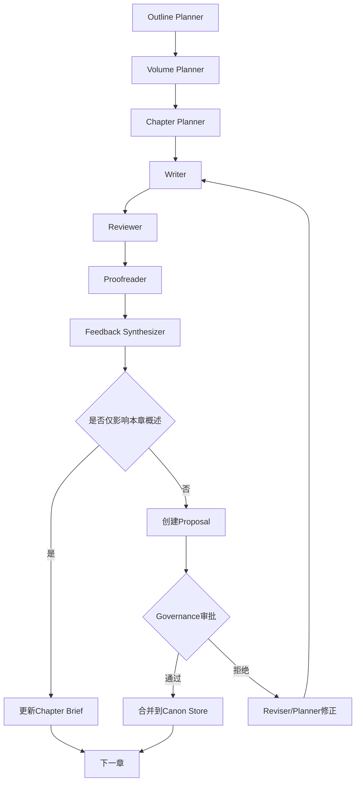

# 分层规划与渐进式披露架构设计

## 当前实现

- `NovelState` 已包含 `volume_briefs`、`chapter_briefs`、`context_decisions`、`proposals` 等字段。
- Pipeline 已包含 `volume_planner`、`chapter_planner`、`feedback_synthesizer` 等节点。
- 当前系统已经具备按需扩展上下文和回写提案的基础骨架。

## 后续计划

1. 把更多上下文升级触发器和预算策略落到实际节点实现中。
2. 为 proposal 审批与回滚补充更明确的持久化与 UI 支持。

## 1. 背景与目标

当前 Pipeline 已具备审稿-修改闭环与消息总线，但在长篇场景下仍存在两个典型问题：

1. 上下文装载策略偏静态，易出现过载（token 浪费）或欠载（信息不足）。
2. 章节正文与高层规划之间缺少受控反哺机制，容易造成规划与实际叙事脱节。

本设计目标：

1. 建立稳定的分层内容工件链路：大纲 -> 卷纲 -> 章节概述 -> 章节正文。
2. 将上下文注入从静态拼接升级为“渐进式披露 + 按需升级加载”。
3. 建立“提案制”反哺机制，避免高层规划被低层输出直接污染。
4. 在保证一致性的前提下降低 token 成本与平均生成时延。

## 2. 核心原则

1. 单一真源：高层规划与角色设定必须有明确 canonical 数据源。
2. 默认最小上下文：先加载摘要与概述，仅在触发条件满足时升级加载原文。
3. 反哺受控：章节可直接修正章节概述，但卷纲/大纲/人物画像更新必须走提案审批。
4. 可追溯：每次加载决策、反哺决策都要记录原因、证据和影响范围。
5. 可回滚：任何跨层更新必须有版本号与回滚点。

## 3. 分层内容模型

### 3.1 四层工件

1. L1 大纲（Book Outline）
- 全书主题、主线冲突、世界观边界、结局约束。

2. L2 卷纲（Volume Outline）
- 每卷目标、关键矛盾、阶段性里程碑、章节配额。

3. L3 章节概述（Chapter Brief）
- 章目标、场景列表、冲突点、角色出场、与前后章因果钩子。

4. L4 章节正文（Chapter Draft / Final）
- 实际创作文本及其评估结果（审稿、校对、一致性指标）。

### 3.2 数据分区

建议新增两个逻辑存储区（可映射到现有 state + storage）：

1. Canon Store（已批准真相）
- outline, volume_outline, chapter_briefs, character_profiles, world_rules。

2. Proposal Store（待批准变更）
- 低层反哺产生的跨层修改提案，不直接生效。

## 4. 目标流程

## 4.1 下行生产链（规划到生成）

1. Outline Planner：生成/修订 L1 大纲。
2. Volume Planner：基于 L1 生成 L2 卷纲（含章节故事线）。
3. Chapter Planner：将 L2 拆解为 L3 章节概述。
4. Writer：基于 L3 生成 L4 章节正文。
5. Reviewer/Proofreader：对 L4 评估并输出结构化反馈。

## 4.2 上行反哺链（生成到规划）

1. L4 -> L3 直接回写（允许）：
- 若正文发生轻微偏航，可更新章节概述的场景顺序、叙事细节、伏笔状态。

2. L4/L3 -> L2/L1/角色画像 提案回写（需审批）：
- 若偏航已影响卷级里程碑、主线逻辑、人物核心设定，则生成 proposal。

3. Governance Agent（或规划 Agent）审批 proposal：
- 通过后写入 Canon Store；拒绝则下发修正任务给 Reviser/Planner。

## 5. 渐进式披露与按需加载

## 5.1 默认加载包（最低成本）

Writer 默认仅加载：

1. 当前章节概述（L3 current）。
2. 前后 1~2 章概述（L3 neighbors）。
3. 本章出场角色的压缩画像（只含本章必需字段）。
4. 本卷关键约束摘要（L2 constraints summary）。

Reviewer/Proofreader 默认仅加载：

1. 当前章正文。
2. 当前章概述。
3. 前一章结尾摘要与后一章目标摘要。
4. 本章出场角色画像（压缩版）。

## 5.2 升级加载触发器

仅当触发器命中才升级上下文：

1. 因果断裂风险高：加载前后章正文片段。
2. 角色行为冲突：加载相关角色完整画像与关系子图。
3. 设定冲突：加载世界观规则、时间线细表。
4. 证据不足：加载卷纲对应段落（而非全量卷纲）。
5. 多次评估不通过：逐级扩大窗口（概述 -> 片段 -> 全文）。

## 5.3 预算约束

为每个节点定义 context budget：

1. hard_budget：绝对上限，超出则必须替换为摘要。
2. soft_budget：建议上限，超过触发压缩策略。
3. min_required：任务最低必要信息，低于该值不执行。

预算执行顺序建议：

1. 先保留“当前章概述 + 当前章正文”。
2. 再保留“相关角色压缩画像”。
3. 其余上下文按信息增益排序保留。

## 6. 反哺治理机制（防漂移）

## 6.1 变更类型

1. Local Patch（本章内）：直接更新 chapter_brief。
2. Cross-Chapter Patch（跨章）：更新相邻章 brief，需轻审批。
3. Cross-Volume Patch（跨卷）：必须 proposal + 审批。
4. Canon Retcon（核心设定改写）：必须人工或高置信审批。

## 6.2 Proposal 最小结构

每条提案至少包含：

1. proposal_id / source_chapter / created_by。
2. target_layer（L2/L1/character/world）。
3. diff 摘要（旧值 -> 新值）。
4. reason（证据片段 + 评估指标）。
5. impact_scope（受影响卷/章节/角色）。
6. confidence 与 risk_level。
7. rollback_point。

## 6.3 审批策略

1. auto-approve：低风险且置信高的 L3 局部修正。
2. agent-approve：中风险由 Governance Agent 审批。
3. human-approve：高风险（世界规则、人物核心设定、主线终局）必须人工。

## 7. 组件设计建议

建议在现有 Pipeline 基础上增加以下逻辑组件（不要求立即重构全链路）：

1. Context Orchestrator
- 输入任务类型与 state，输出“加载包”与预算执行结果。

2. Relevance Selector
- 从角色库、章节库、世界设定中筛出与当前任务最相关子集。

3. Budget Manager
- 估算上下文长度并执行压缩、淘汰、替换策略。

4. Feedback Synthesizer
- 将审稿/校对/一致性结果转换为结构化反哺项。

5. Proposal Manager
- 管理提案生命周期（创建、审批、合并、拒绝、回滚）。

6. Governance Agent
- 负责跨层变更裁决与冲突仲裁。

## 8. 与现有模块映射

可逐步映射到现有代码结构：

1. Pipeline 节点编排：pipeline/novel_pipeline.py
- 增加 planner/proposal/governance 节点与条件边。

2. 全局状态：core/state.py
- 新增 chapter_briefs、context_budget、proposals、canonical_versions。

3. Prompt 组装：core/prompt_assembler.py
- 将静态拼接改为接受 Context Orchestrator 的分层输入。

4. 记忆系统：core/memory.py
- 作为一致性证据源，不再默认全量注入。

5. Agent 通信：core/agent.py + MessageBus
- 消息从“日志用途”升级到“上下文选择与审批事件驱动”。

## 9. 状态机草图（逻辑）

## 10. 分阶段实施路线

## Phase 1（低风险，高收益）

1. 引入 chapter_brief 作为独立工件。
2. Writer 默认基于 brief + 邻章 brief 写作。
3. 上下文加载加入预算硬上限。

验收指标：

1. 平均 prompt 长度下降。
2. 审稿轮次不增加（或下降）。

## Phase 2（中风险，中收益）

1. 增加 Context Orchestrator 与 Relevance Selector。
2. 角色画像按“涉及角色”动态加载。
3. 增加反哺到 chapter_brief 的自动回写。

验收指标：

1. 角色一致性问题率下降。
2. 生成时延稳定或下降。

## Phase 3（高价值）

1. 引入 Proposal Store + Governance Agent。
2. 支持卷纲/大纲/人物画像的提案式更新。
3. 提供审批日志与回滚能力。

验收指标：

1. 跨章设定冲突率下降。
2. 高层规划变更可追溯率达到 100%。

## 11. 风险与防护

1. 风险：过度反哺导致规划震荡。
- 防护：跨层更新必须提案审批，且设置冷却窗口。

2. 风险：相关性选择误判导致漏信息。
- 防护：失败重试时按层级扩大窗口，并记录触发原因。

3. 风险：Budget 策略过紧影响质量。
- 防护：定义 min_required 与任务失败兜底加载策略。

4. 风险：系统复杂度提升。
- 防护：按 Phase 递进落地，先做可观测性再做自动化审批。

## 12. 结论

该架构将“写作任务”重构为“规划驱动 + 受控生成 + 可审计演化”的系统工程：

1. 通过分层工件降低长文本系统的不确定性。
2. 通过渐进式披露控制 token 与时延成本。
3. 通过提案制反哺保证高层设定稳定与可回滚。

这与 StoryForge 当前的 Pipeline、状态模型和消息机制兼容，可在不推翻现有结构的前提下持续扩展。
